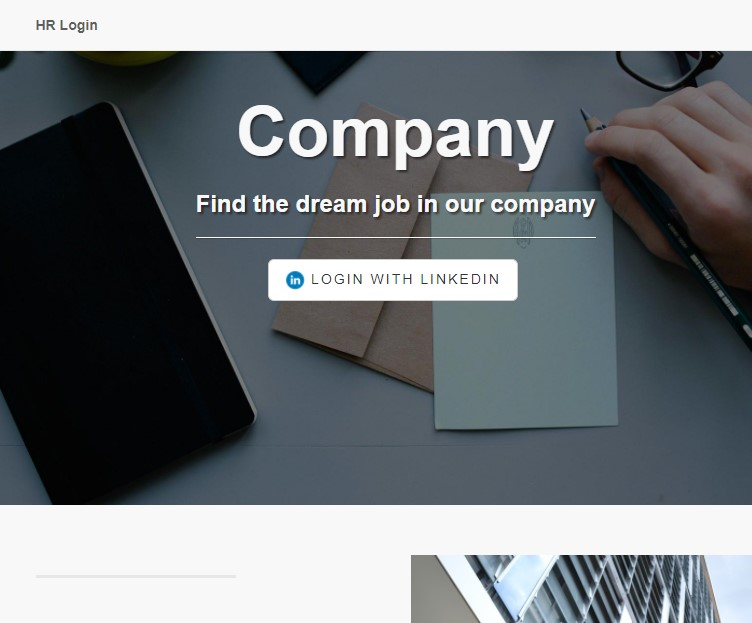
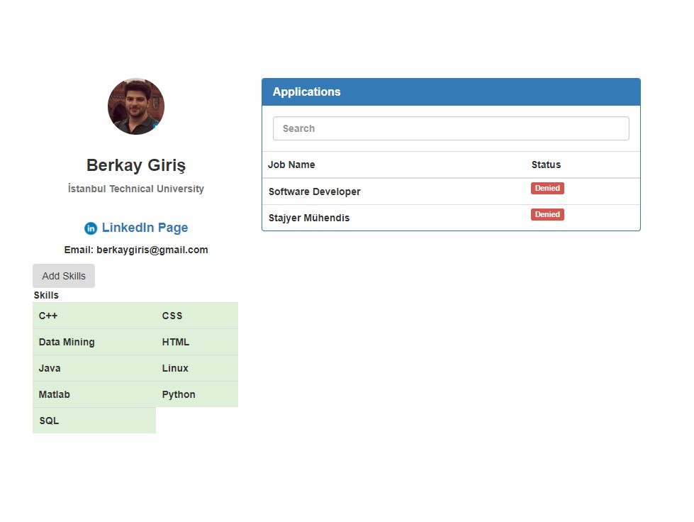
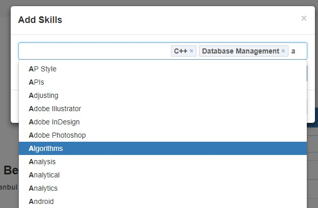
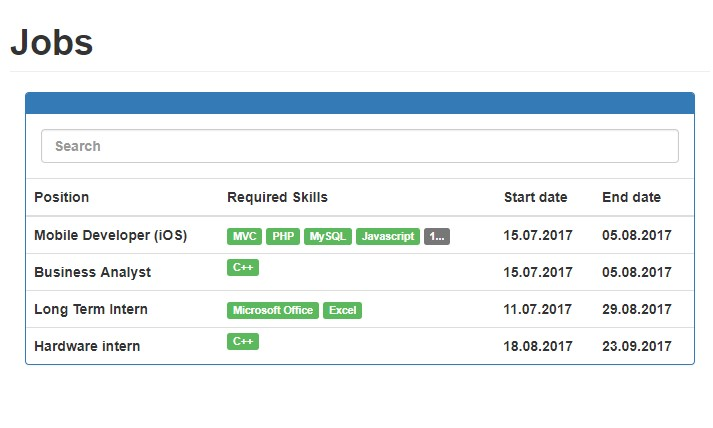
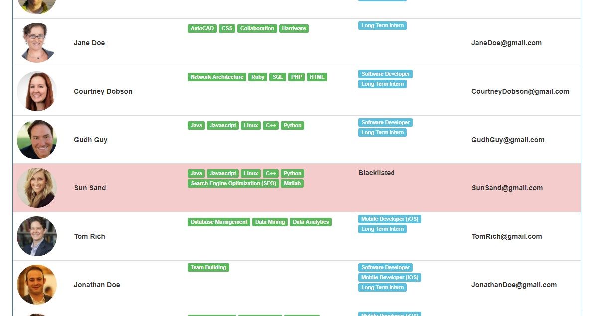

# Jobsite

JobSite is a project I made in the summer of 2017 to improve my web skills. It is simply a company website to list job offers.

# Features!
    
  - LinkedIn login
  - LDAP Authentication
  - Admins  
  
        - Create new job posts.
        - Browse users
        - Answer applications
        - Blacklisting
        
  - Users
  
        - Add professional skills
        - Browse jobs and apply to them

# Technologies!

# Screenshots

